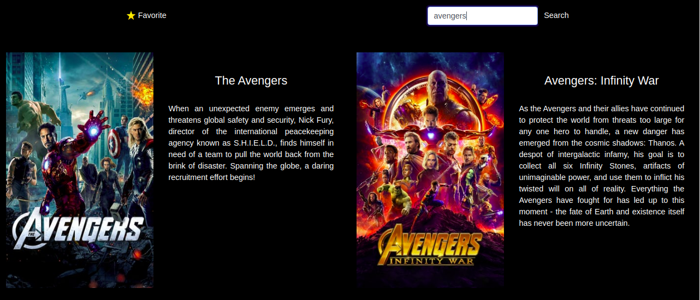
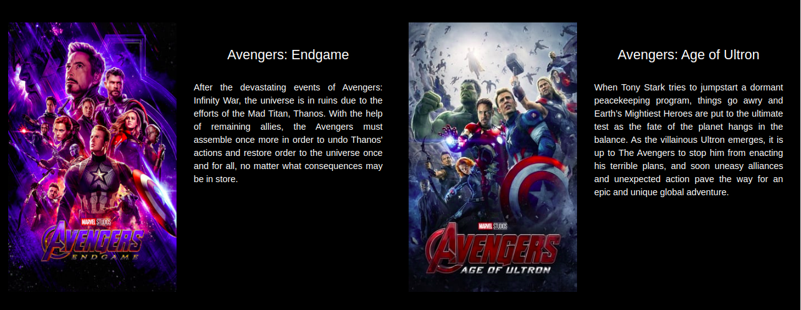

# GeeksHubs-Proyecto-Consumo-de-API-Externa-con-Angular

_Web que consume de la API themoviedb, donde se pueden filtrar peliculas por titulo, también esta la opción de filtrar las peliculas más populares.

Este proyecto es una  práctica de consumo de Api’s externas con Angular.

La web es responsive, y se adapta a todos los dispositivos móviles._


## Comenzando 🚀

_Para obtener una copia del proyecto en funcionamiento en tu máquina local para propósitos de desarrollo y pruebas, necesitaras descargarlo o clonar el repositorio a tu máquina._


### Tecnologías🛠️

Programas y Frameworks utilizados para el desarrollo y pruebas del proyecto:

* [VSCode] - Editor de código usado - (https://code.visualstudio.com/).
* [Angular] - Framework de desarrollo.
* [Bootstrap] - Es un frameword de diseño;
* [GitHub] - Control de versiones.


### Instalación 🔧

Una vez descargado, descomprimido y ubicado en el directorio del proyecto, instale las dependencias y devDependencies.

```sh
$ npm install
```

Inicie el servidor

```sh
$ ng serve
```

Las instrucciones sobre cómo usarlas en su propia aplicación están vinculadas a continuación.
GitHub  [plugins/github/README.md][PlGh] 

## Imagenes






## Wiki 📖

Puedes encontrar mucho más de cómo utilizar este proyecto en nuestra [Wiki](https://github.com/jocamo00/BuscadorDePeliculas_Angular/tree/master)

## Versionado 📌

Usamos [GitHub](https://github.com/) para el versionado. Para todas las versiones disponibles, mira los [tags en este repositorio](https://github.com/jocamo00/BuscadorDePeliculas_Angular/tree/master).

## Autor ✒️

* **Jose Carreres** - [jocamo00](https://github.com/jocamo00)


